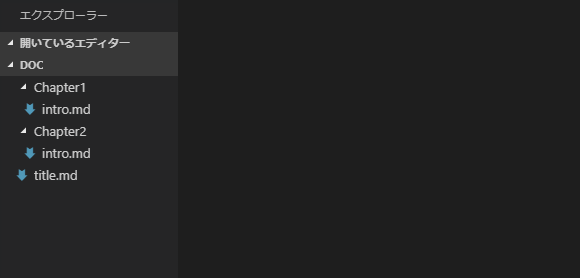
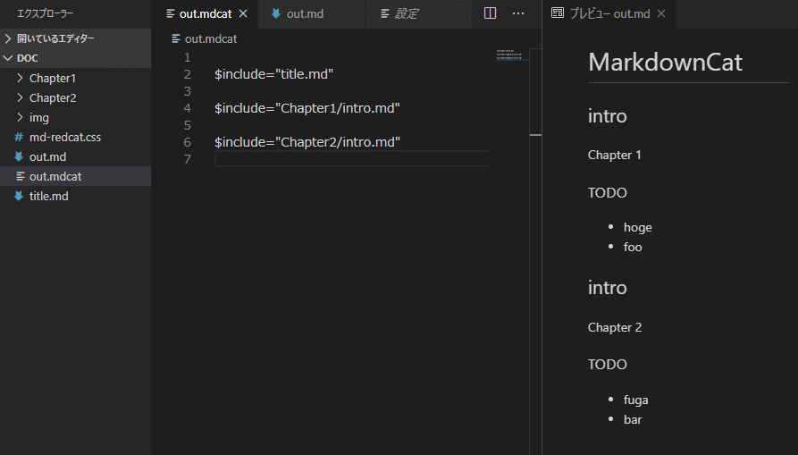
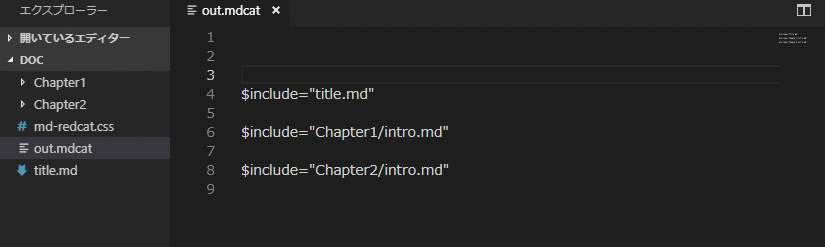
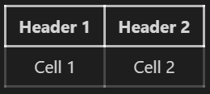
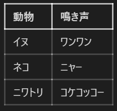
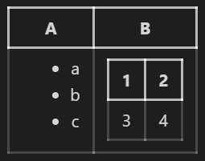
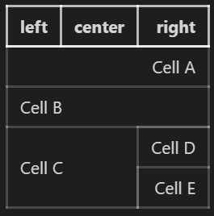
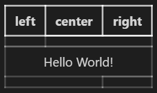

# MarkdownCat

複数の Markdown ファイルを結合して１つの Markdown ファイルを作成します。

## 使い方

### マークダウンファイルをインクルードする
1. 拡張子が .mdcat  のファイルを作成します
1. 作成した .mdcat ファイルを開きます
1. 結合したい Markdown ファイルを $include="ファイル名" の形式で記述します
1. ポップアップメニューの「Markdown ファイルを作成」を選ぶとMarkdown ファイルを作成します。



### 見出しを除外する

指定した見出しの内容を除外できます。



### CSSファイルをインクルードする

$includeで cssファイルをインクルードすると \<style\>で囲って出力します。



### テーブル拡張（β版)
テーブル構成とセルの内容を分離して記述できます。

<pre>
```mdcat.table
|     |     |
|:---:|:---:|
|     |     |

# 0-0
Header 1

# 0-1
Header 2

# 1-0
Cell 1

# 1-1
Cell 2
```</pre>




Markdown 記法と合わせて使うことができます。

<pre>
```mdcat.table

|動物     |鳴き声|
|:--------|:----|
|イヌ     |     |
|ネコ     |     |
|ニワトリ |     |

# 1-1
ワンワン

# 2-1
ニャー

# 3-1
コケコッコー
```</pre>



表を入れ子にできます

<pre>
```mdcat.table

| A   | B   |
|:---:|:---:|
|     |     |

# 1-0
* a
* b
* c

# 1-1
|1    |2    |
|:---:|:---:|
|3    |4    |
```</pre>



セルを結合できます

```mdcat.table

|left  |center|right |
|:-----|:----:|-----:|
|>     |>     |      |
|      |<     |<     |
|      |<     |      |
|^     |^     |      |

# 1-0
Cell A

# 2-0
Cell B

# 3-0
Cell C

# 3-2
Cell D

# 4-2
Cell E
```



セルにラベルをつけられます

```mdcat.table

|left  |center|right |
|:-----|:----:|-----:|
|      |>     |      |
|>     |hello |<     |
|      |<     |      |

# hello 
Hello World!
```




## License

The source code and strings are licensed under the [MIT](license.md) license.
